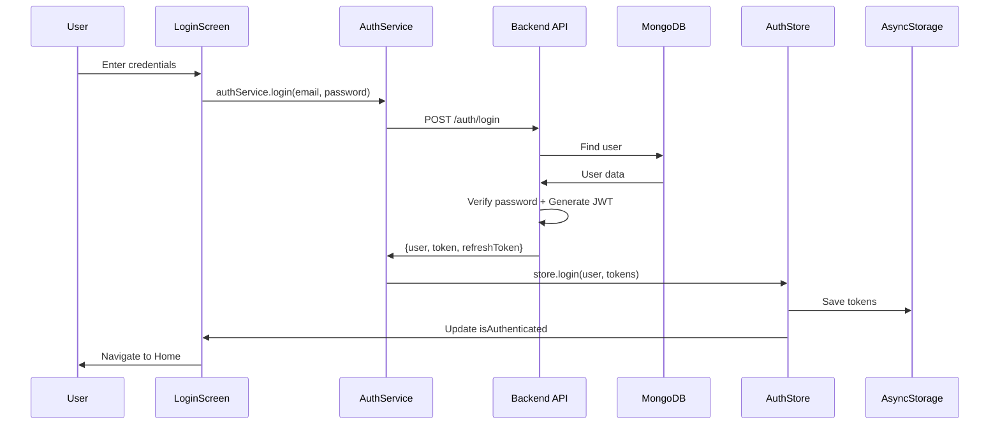

# 🏗️ LifeHub - Guide d'Architecture et de Développement

## 📑 Table des matières

1. [Vue d'ensemble](#vue-densemble)
2. [Architecture Backend](#architecture-backend)
3. [Architecture Frontend](#architecture-frontend)
4. [Flux de données](#flux-de-données)
5. [Modules détaillés](#modules-détaillés)
6. [Guide de développement](#guide-de-développement)
7. [APIs et Intégrations](#apis-et-intégrations)
8. [Déploiement](#déploiement)

---

## 🎯 Vue d'ensemble

LifeHub utilise une architecture **modulaire** et **scalable** qui sépare clairement les responsabilités:

```
┌─────────────────────────────────────────────────┐
│              MOBILE APP (React Native)          │
│  ┌──────────┐  ┌──────────┐  ┌──────────┐     │
│  │  UI      │  │  Store   │  │ Services │     │
│  │ Screens  │→ │ Zustand  │→ │   API    │──┐  │
│  └──────────┘  └──────────┘  └──────────┘  │  │
└─────────────────────────────────────────────┼──┘
                                              │
                                          HTTP/WS
                                              │
┌─────────────────────────────────────────────┼──┐
│              BACKEND (Node.js)              │  │
│  ┌──────────┐  ┌──────────┐  ┌──────────┐  │  │
│  │ Express  │  │ GraphQL  │  │WebSocket │←─┘  │
│  │   REST   │  │  Apollo  │  │Socket.io │     │
│  └────┬─────┘  └────┬─────┘  └────┬─────┘     │
│       │             │             │            │
│  ┌────┴─────────────┴─────────────┴─────┐     │
│  │         Business Logic (Modules)      │     │
│  │  Auth│Tasks│Finance│Health│Social│AI │     │
│  └────┬─────────────┬─────────────┬─────┘     │
│       │             │             │            │
│  ┌────┴─────┐  ┌───┴────┐   ┌────┴─────┐     │
│  │ MongoDB  │  │Postgres│   │  Redis   │     │
│  │  (NoSQL) │  │  (SQL) │   │ (Cache)  │     │
│  └──────────┘  └────────┘   └──────────┘     │
└─────────────────────────────────────────────────┘
```

---

## 🖥️ Architecture Backend

### Couches de l'architecture

```
src/
├── server.ts              # Point d'entrée
├── app.ts                 # Configuration Express
├── config/                # Configurations
│   ├── index.ts          # Config centralisée
│   └── logger.ts         # Winston logger
├── database/              # Connexions DB
│   ├── mongodb.ts        # MongoDB singleton
│   ├── postgres.ts       # PostgreSQL singleton
│   └── redis.ts          # Redis singleton
├── middleware/            # Middlewares
│   ├── auth.middleware.ts        # Authentification JWT
│   ├── validate.middleware.ts    # Validation Joi
│   ├── rateLimit.middleware.ts   # Rate limiting
│   └── error.middleware.ts       # Gestion erreurs
├── modules/               # Modules métier
│   ├── auth/
│   │   ├── user.model.ts         # Modèle User (Mongoose)
│   │   ├── auth.controller.ts    # Logique auth
│   │   └── auth.routes.ts        # Routes auth
│   ├── tasks/
│   │   ├── task.model.ts
│   │   ├── task.controller.ts
│   │   ├── task.service.ts       # Business logic
│   │   └── task.routes.ts
│   ├── finance/           # Finance personnelle
│   ├── health/            # Santé & fitness
│   ├── travel/            # Voyage & exploration
│   ├── social/            # Réseau social
│   ├── ai/                # Assistant IA
│   ├── media/             # Media & streaming
│   └── gamification/      # Points, badges
└── services/              # Services externes
    ├── email.service.ts
    ├── storage.service.ts
    ├── ai.service.ts
    └── maps.service.ts
```

### Principes de conception Backend

1. **Separation of Concerns**: Chaque module est indépendant
2. **Dependency Injection**: Services injectés dans les controllers
3. **Error Handling**: Gestion centralisée des erreurs
4. **Validation**: Toutes les entrées validées avec Joi
5. **Security**: JWT, rate limiting, helmet, CORS
6. **Logging**: Winston pour logs structurés
7. **Testing**: Jest pour tests unitaires et d'intégration

### Flux d'une requête API

```
Request → Middleware (Auth, Rate Limit, Validation)
         ↓
      Controller (Logique HTTP)
         ↓
      Service (Business Logic)
         ↓
      Model (Base de données)
         ↓
      Response ← Middleware (Error Handler)
```

---

## 📱 Architecture Frontend

### Structure des dossiers

```
src/
├── App.tsx                # Point d'entrée
├── navigation/            # React Navigation
│   ├── RootNavigator.tsx
│   ├── AuthNavigator.tsx
│   ├── MainNavigator.tsx
│   └── types.ts
├── screens/               # Écrans
│   ├── auth/
│   │   ├── LoginScreen.tsx
│   │   ├── RegisterScreen.tsx
│   │   └── ForgotPasswordScreen.tsx
│   ├── home/
│   ├── tasks/
│   ├── finance/
│   └── profile/
├── components/            # Composants réutilisables
│   ├── common/
│   │   ├── Button.tsx
│   │   ├── Card.tsx
│   │   ├── Input.tsx
│   │   └── Loading.tsx
│   ├── tasks/
│   └── finance/
├── modules/               # Modules métier (logique)
│   ├── tasks/
│   │   ├── types.ts
│   │   ├── hooks/
│   │   │   ├── useTasks.ts
│   │   │   └── useTask.ts
│   │   └── components/
│   └── finance/
├── services/              # Clients API
│   ├── api.service.ts    # Axios instance
│   ├── auth.service.ts
│   ├── task.service.ts
│   └── socket.service.ts
├── store/                 # State management (Zustand)
│   ├── authStore.ts
│   ├── appStore.ts
│   └── taskStore.ts
├── hooks/                 # Custom hooks
│   ├── useAuth.ts
│   ├── useNetwork.ts
│   └── useNotifications.ts
├── utils/                 # Helpers
│   ├── dates.ts
│   ├── validation.ts
│   └── formatters.ts
├── theme/                 # Design system
│   ├── index.ts
│   ├── colors.ts
│   └── typography.ts
├── config/                # Configuration
│   └── index.ts
└── types/                 # TypeScript types
    └── index.ts
```

### Principes de conception Frontend

1. **Component Composition**: Composants petits et réutilisables
2. **State Management**: Zustand pour état global, React Query pour cache serveur
3. **Type Safety**: TypeScript strict partout
4. **Performance**: Memoization, lazy loading, virtualisation
5. **Offline-First**: WatermelonDB pour données locales
6. **Accessibility**: Support des lecteurs d'écran
7. **Responsive**: Adapté à toutes les tailles d'écran

### Flux de données Frontend

```
User Action (UI)
     ↓
Custom Hook (useTask, useAuth...)
     ↓
Service (API call)
     ↓
Zustand Store (Update state)
     ↓
Component Re-render
```

---

## 🔄 Flux de données

### Authentification Flow



### CRUD Flow (Tâches exemple)

```
Create Task:
  User → TaskScreen → useCreateTask hook → taskService.create()
  → API POST /tasks → MongoDB → Response → Store update → UI update

Read Tasks:
  Component mount → useTasks hook → taskService.getAll()
  → API GET /tasks → MongoDB → Cache in React Query → Render list

Update Task:
  User edit → useUpdateTask → taskService.update(id, data)
  → API PATCH /tasks/:id → MongoDB → Optimistic update → Sync

Delete Task:
  User delete → useDeleteTask → taskService.delete(id)
  → API DELETE /tasks/:id → MongoDB → Remove from store → UI update
```

---

## 📦 Modules détaillés

### Module Auth (Authentification)

**Backend:**
- `user.model.ts`: Modèle User Mongoose
- `auth.controller.ts`: Register, login, verify email, reset password
- `auth.routes.ts`: Routes Express
- Middleware: JWT verification, MFA

**Frontend:**
- `LoginScreen`: UI de connexion
- `RegisterScreen`: Inscription
- `authService`: Appels API
- `authStore`: État authentification
- `useAuth`: Hook personnalisé

**Features:**
- ✅ Register with email validation
- ✅ Login with JWT
- ✅ Refresh token rotation
- ✅ Password reset
- ✅ Email verification
- ✅ OAuth (Google, Facebook, Apple)
- ✅ Multi-Factor Authentication

---

### Module Tasks (Tâches & Productivité)

**Modèle de données:**
```typescript
interface Task {
  id: string;
  userId: string;
  title: string;
  description?: string;
  status: 'todo' | 'in-progress' | 'completed' | 'cancelled';
  priority: 'low' | 'medium' | 'high' | 'urgent';
  dueDate?: Date;
  category?: string;
  tags: string[];
  aiPriority?: number;  // Score IA 0-100
  location?: {
    coordinates: [number, number];
    address?: string;
  };
  subtasks: { title: string; completed: boolean }[];
  recurrence?: {
    frequency: 'daily' | 'weekly' | 'monthly';
    interval: number;
  };
}
```

**APIs:**
- `GET /api/tasks` - Liste des tâches
- `GET /api/tasks/:id` - Détail tâche
- `POST /api/tasks` - Créer tâche
- `PATCH /api/tasks/:id` - Modifier tâche
- `DELETE /api/tasks/:id` - Supprimer tâche
- `POST /api/tasks/:id/ai-prioritize` - Priorisation IA

**Features:**
- ✅ CRUD complet
- ✅ Filtres (status, priority, category, tags)
- ✅ Recherche
- ✅ Priorisation IA
- ✅ Notifications géolocalisées
- ✅ Tâches récurrentes
- ✅ Sous-tâches
- ✅ Partage de tâches
- ✅ Sync offline

---

### Module Finance

**Modèle PostgreSQL:**
```sql
CREATE TABLE transactions (
  id UUID PRIMARY KEY,
  user_id UUID NOT NULL,
  type VARCHAR(10) CHECK (type IN ('income', 'expense')),
  amount DECIMAL(12, 2) NOT NULL,
  category VARCHAR(50),
  description TEXT,
  date TIMESTAMP DEFAULT NOW(),
  tags TEXT[],
  created_at TIMESTAMP DEFAULT NOW()
);
```

**Features:**
- ✅ Tracker revenus/dépenses
- ✅ Catégorisation automatique
- ✅ Graphiques (revenus vs dépenses)
- ✅ Budget mensuel
- ✅ Alertes dépassement
- ✅ Export CSV/PDF
- ✅ Intégration CoinGecko (crypto)
- ✅ Taux de change

---

### Module Health (Santé & Fitness)

**Features:**
- ✅ Tracker pas (Google Fit API)
- ✅ Calories consommées (Nutritionix)
- ✅ Hydratation
- ✅ Sommeil
- ✅ Méditation
- ✅ Défis communautaires
- ✅ Graphiques progression
- ✅ Intégration wearables

---

### Module Social

**WebSocket Events:**
```typescript
// Chat events
socket.on('message:send', (data) => {});
socket.on('message:received', (data) => {});
socket.on('typing:start', (data) => {});
socket.on('typing:stop', (data) => {});

// Feed events
socket.on('post:new', (data) => {});
socket.on('post:like', (data) => {});
socket.on('post:comment', (data) => {});
```

**Features:**
- ✅ Feed social (posts, likes, comments)
- ✅ Stories (24h expiration)
- ✅ Chat temps réel
- ✅ Groupes
- ✅ Notifications push
- ✅ Profils utilisateurs
- ✅ Follow/Unfollow

---

### Module AI (Assistant IA)

**Intégrations:**
- OpenAI GPT-3.5/4 pour chatbot
- HuggingFace pour NLP

**Features:**
- ✅ Chatbot conversationnel
- ✅ Résumé de texte
- ✅ Traduction multilingue
- ✅ Analyse de sentiment
- ✅ Recommandations personnalisées
- ✅ Priorisation de tâches
- ✅ Analyse financière

---

## 🛠️ Guide de développement

### Setup initial

```bash
# 1. Cloner le repo
git clone https://github.com/your-user/lifehub.git
cd lifehub

# 2. Installer les dépendances backend
cd lifehub-backend
npm install
cp .env.example .env
# Configurer .env avec vos clés

# 3. Lancer les bases de données (Docker)
docker-compose up -d mongodb postgres redis

# 4. Démarrer le backend
npm run dev

# 5. Dans un autre terminal, installer mobile
cd ../lifehub-mobile
npm install

# 6. Démarrer l'app mobile
npx expo start
```

### Créer un nouveau module

**Backend:**
```bash
cd lifehub-backend/src/modules
mkdir my-module
touch my-module/my-module.model.ts
touch my-module/my-module.controller.ts
touch my-module/my-module.service.ts
touch my-module/my-module.routes.ts
```

**Frontend:**
```bash
cd lifehub-mobile/src/modules
mkdir my-module
touch my-module/types.ts
mkdir my-module/hooks
touch my-module/hooks/useMyModule.ts
mkdir my-module/components
```

### Tests

```bash
# Backend
cd lifehub-backend
npm test
npm run test:coverage

# Mobile (Jest + React Native Testing Library)
cd lifehub-mobile
npm test
```

---

## 🌐 APIs et Intégrations

### APIs gratuites intégrées

| Service | API | Usage | Limite gratuite |
|---------|-----|-------|-----------------|
| OpenAI | GPT-3.5 | Chatbot IA | $18 free credit |
| HuggingFace | Inference API | NLP, traduction | Gratuit |
| CoinGecko | Crypto API | Prix crypto | 10-50 req/min |
| Nutritionix | Food API | Nutrition | 200 req/day |
| OpenWeatherMap | Weather API | Météo | 60 req/min |
| Mapbox | Maps API | Cartes, itinéraires | 200k req/month |
| Foursquare | Places API | Lieux, restaurants | 100k req/month |
| Firebase | Auth, Storage | Auth sociale, stockage | Gratuit jusqu'à 50k MAU |

### Configurer les clés API

Fichier `.env` backend:
```env
OPENAI_API_KEY=sk-...
HUGGINGFACE_API_KEY=hf_...
COINGECKO_API_KEY=
NUTRITIONIX_API_KEY=...
NUTRITIONIX_API_ID=...
MAPBOX_ACCESS_TOKEN=pk....
FOURSQUARE_API_KEY=...
OPENWEATHERMAP_API_KEY=...
```

---

## 🚀 Déploiement

### Backend (Node.js)

**Options:**
1. **Heroku** (facile, gratuit tier disponible)
2. **AWS EC2** (plus de contrôle)
3. **DigitalOcean Droplet** (simple, économique)
4. **Render** (moderne, facile)

```bash
# Exemple: Déploiement sur Heroku
heroku create lifehub-api
heroku addons:create heroku-postgresql:mini
heroku addons:create heroku-redis:mini
git push heroku main
```

### Mobile (React Native + Expo)

**Options:**
1. **Expo EAS Build** (recommandé)
2. **Manual build** (plus de contrôle)

```bash
# Build avec EAS
npm install -g eas-cli
eas login
eas build --platform ios
eas build --platform android

# Submit aux stores
eas submit --platform ios
eas submit --platform android
```

---

## 📚 Ressources

- [React Native Docs](https://reactnative.dev/docs/getting-started)
- [Expo Docs](https://docs.expo.dev/)
- [Node.js Best Practices](https://github.com/goldbergyoni/nodebestpractices)
- [MongoDB Schema Design](https://www.mongodb.com/docs/manual/core/data-modeling-introduction/)
- [React Navigation](https://reactnavigation.org/docs/getting-started)

---

## 🤝 Contributing

Voir [CONTRIBUTING.md](CONTRIBUTING.md) pour les guidelines.

---

**Made with ❤️ by the LifeHub Team**
